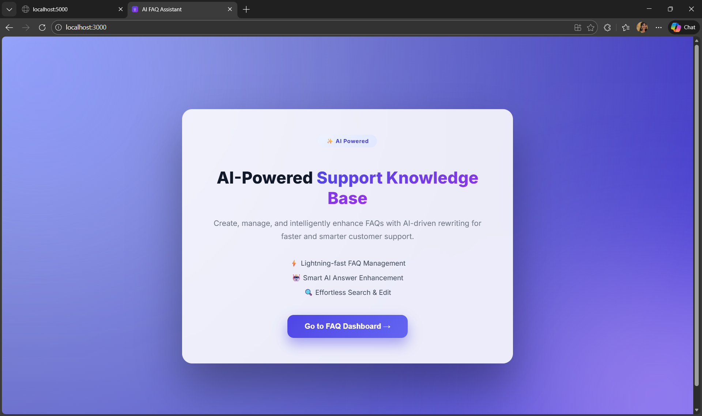
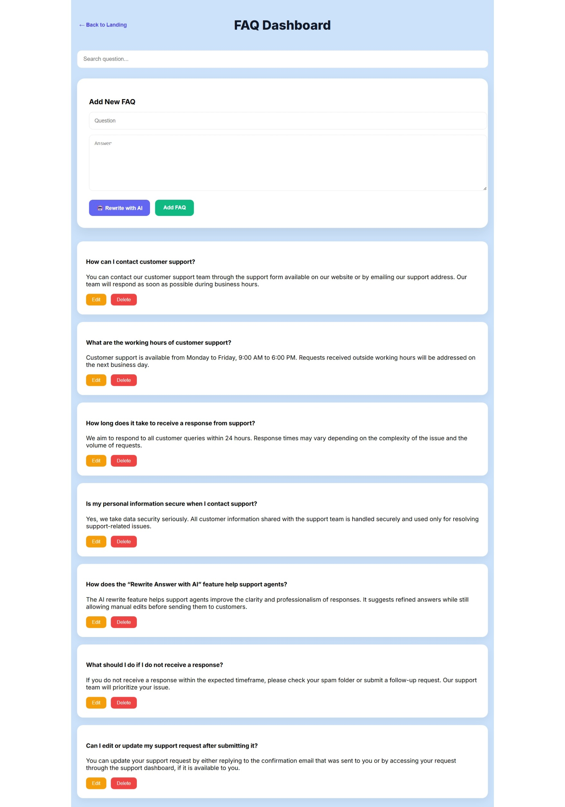
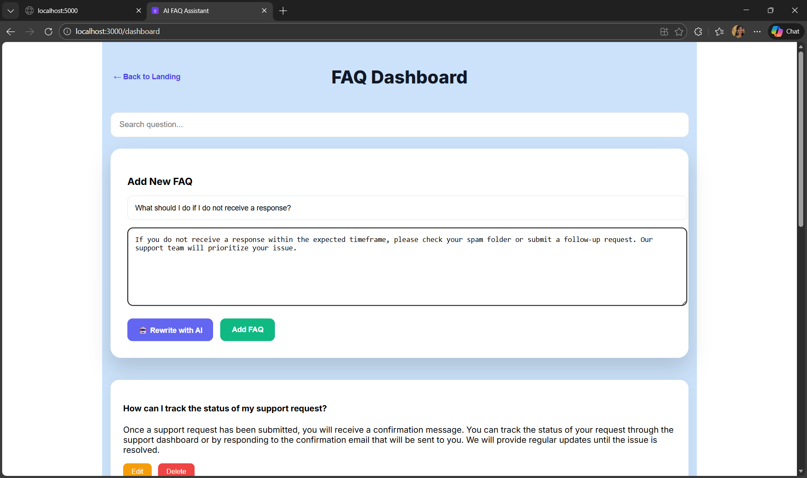
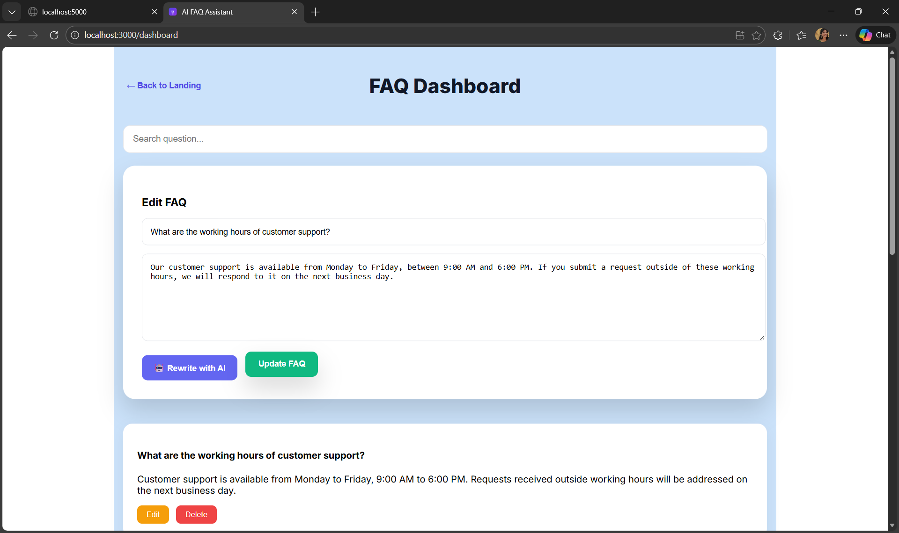
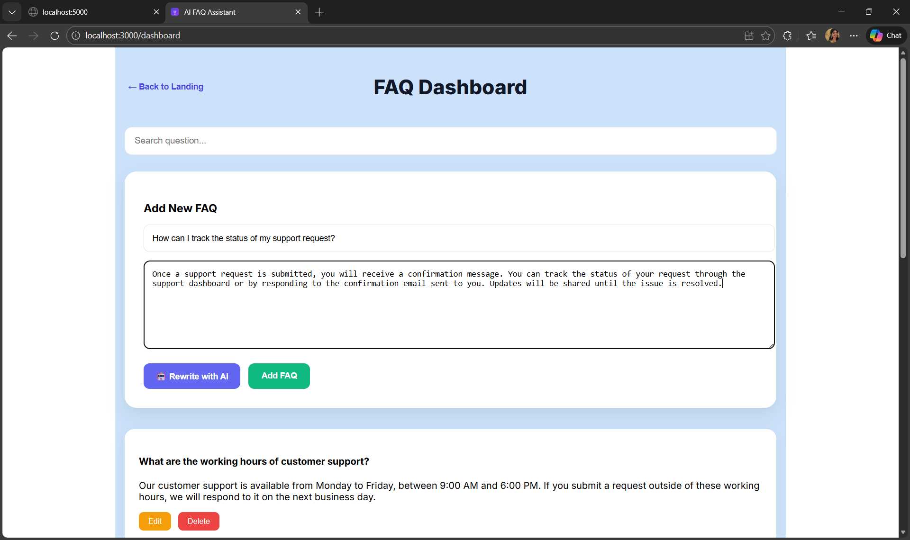
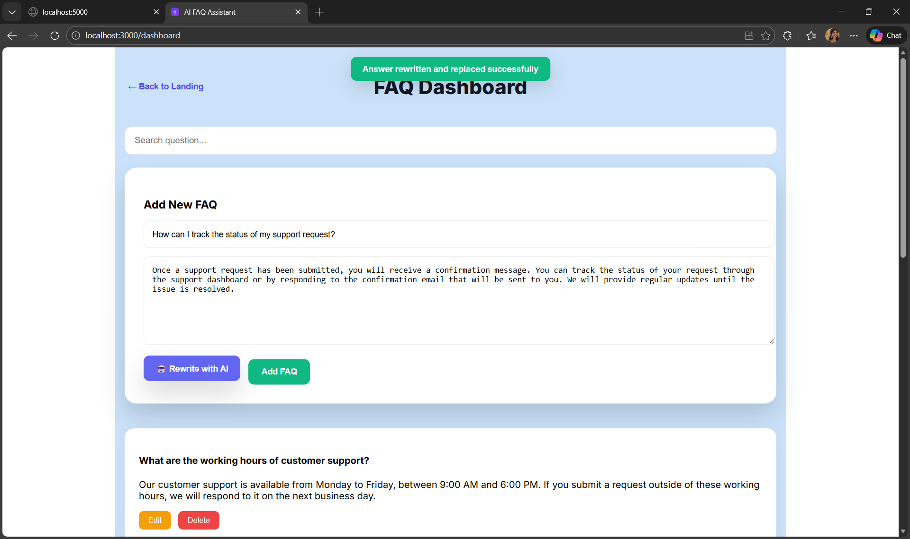
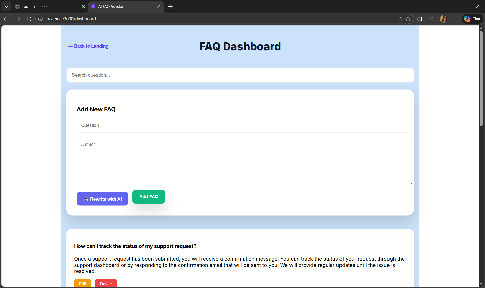
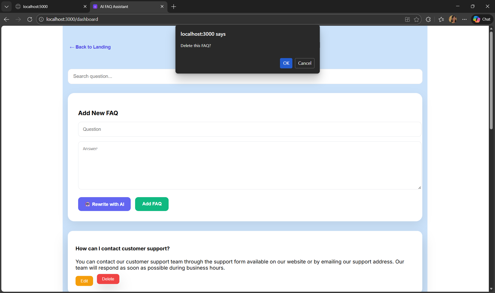
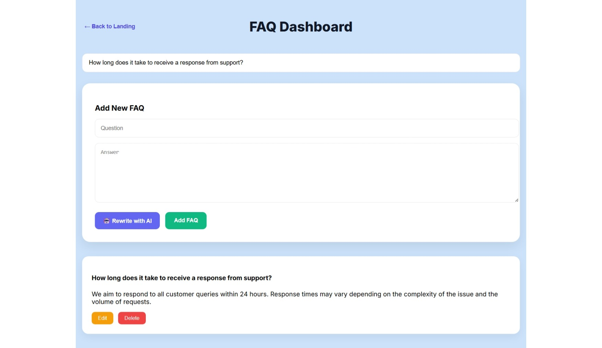

AI-Powered Customer Support FAQ Assistant

Project Overview

The AI-Powered Customer Support FAQ Assistant is a full-stack web application designed to manage Frequently Asked Questions (FAQs) efficiently.
It provides complete CRUD functionality along with an optional AI-based answer rewriting feature that helps refine and improve FAQ responses.

The project demonstrates:
    Modern frontend development using React + TypeScript
    Backend API development using Node.js + Express
    Database integration using SQLite with Prisma
    Integration of a modern AI text rewriting API

Objectives
    1. Allow users to add, view, edit, delete, and search FAQs
    2. Provide an AI-powered feature to rewrite FAQ answers in a clearer and  more professional manner
    3. Maintain clean architecture and separation of concerns between CRUD operations and AI functionality

Tech Stack

Frontend
    React.js
    TypeScript
    CSS (Inline Styling)
    Fetch API for communication

Backend
    Node.js
    Express.js
    Prisma ORM
    SQLite Database

AI Integration
    Groq API

Project Structure

ai-faq-assistant/
    frontend/
        public/
        index.html
        favicon.ico
        manifest.json
        src/
            App.tsx
            LandingPage.tsx
            Dashboard.tsx
            api.ts
            logo.svg
            index.tsx
        package.json

    backend/
        src/
            index.ts
            routes/
            faqs.ts
            ai.ts
            prisma/
                schema.prisma
        .env
        package.json

    README.md

Setup Instructions
Prerequisites

Node.js (v16 or higher)
npm
Internet connection (for AI API)

Backend Setup

Navigate to backend folder:
    cd backend
Install dependencies:
    npm install

.env or environment configuration

Create .env file:
DATABASE_URL="file:./dev.db"
AI_API_KEY=your_ai_api_key_here

Run Prisma migration:
npx prisma migrate dev --name init
Start backend server:
    npm run dev
Backend will run on:
http://localhost:5000

Frontend Setup

Navigate to frontend folder:
    cd frontend
Install dependencies:
    npm install

Start frontend server:
    npm start
Frontend will run on:
http://localhost:3000

API Endpoints
GET    /faqs         - Fetch all FAQs
POST   /faqs         - Create new FAQ
PUT    /faqs/:id     - Update existing FAQ
DELETE /faqs/:id     - Delete FAQ
POST   /ai/rewrite   - Rewrite answer using AI

AI Rewrite Feature

The Rewrite Answer with AI button sends the current answer text to the backend via a dedicated API endpoint. The backend, built using Node.js and Express, processes the text using an integrated AI language model (Groq) to generate an improved version of the answer.
The rewritten content is returned to the frontend (React + TypeScript) and replaces the existing answer in the same input field. Users can still edit or modify the AI-generated text before saving. This feature is optional, does not automatically save data, and does not block manual input.

Screenshots of UI
LandingPage

FAQ Dashboard

Add/Create New FAQ

Update/Edit FAQ

AI Rewrite Feature

Delete Confirmation

Searching FAQ

Assumptions & Notes
    The AI rewrite feature is optional and does not automatically save data; users must manually confirm changes.
    SQLite is used as a lightweight, file-based database for simplicity and ease of setup.
    The application is intended for single-admin usage and does not include authentication or role management.
    AI-generated responses may vary based on the input text and model behavior.
    Environment variables are required for AI API access and are not committed to the repository.
    The project focuses on functionality and clarity rather than large-scale deployment.

Validation & Error Handling
    Both Question and Answer fields are required before saving
    Delete operation requires user confirmation
    AI failures do not affect normal CRUD operations

Conclusion
This project demonstrates a complete full-stack solution with modern UI, reliable backend architecture, database persistence, and intelligent AI integration, fulfilling all requirements specified in the assessment.